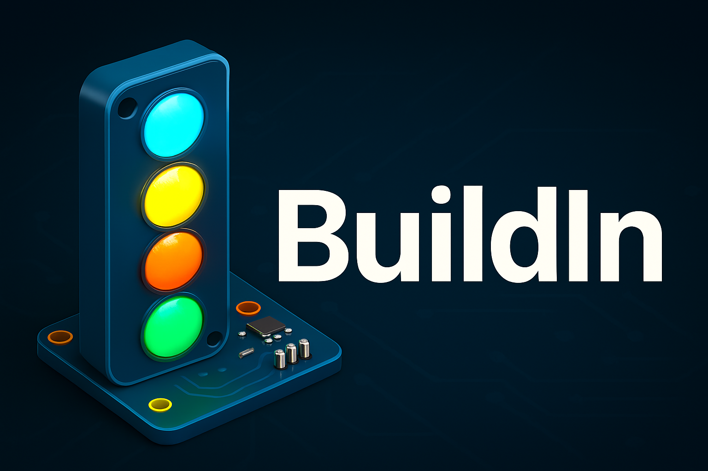

<p align="center">
  
</p>

<h1 align="center">BuildIn</h1>

<p align="center">
  A traffic-semaphore-based indicator for repository build status.
</p>

---

## Table of Contents

- [About](#about)  
- [Features](#features)
- [Hardware](#hardware)
- [Motivation](#motivation)  
- [Usage](#usage)  
  - [Installation](#installation)  
  - [Configuration](#configuration)  
  - [Running / Viewing](#running--viewing)  
- [Contributing](#contributing)  
- [License](#license)  

---

## About

BuildIn is a simple tool that displays the build status of a repository using a traffic-semaphore style indicator (e.g. red, yellow, green). It is designed to make build status easy to glance at in dashboards or embedded views.


## Features

- Uses a traffic light metaphor (blue / yellow / red / green) for build status  
- Meant to be repository-agnostic: works with typical CI/CD pipelines  
- Lightweight, minimal visual overhead  
- Easy to embed or integrate  

## Hardware 
This project requires the following hardware components:

- **Arduino MKR WiFi 1010**  
- **4 LEDs** (Red, Yellow, Green, plus optional Blue for standby/other state)  
- **Breadboard and jumper wires**
- 
⚡ Note: This project does not require external resistors. The LEDs are driven using the `INPUT_PULLUP` configuration on the MKR WiFi 1010 pins.

## Motivation

When managing multiple repositories or monitoring many CI pipelines, it can be tedious to check each status individually. BuildIn provides an intuitive, visual summary of build health using a traffic-semaphore style indicator, allowing quicker assessment at a glance.


## Usage

> **Note:** These are suggested steps. Adjust are recommended based on respective CI, deployment, or display environment.

### Installation

Clone the repository  
   ```bash
   git clone https://github.com/SUNSET-Sejong-University/BuildIn.git
   cd BuildIn/
   ```
### Configuration

1. Open the Arduino sketch folder and edit the `secrets.h` file:  
   - Add your **WiFi network SSID**  
   - Add your **WiFi password**  
   - Add a **GitHub Personal Access Token** (required to fetch build status)  

   ```cpp
   // secrets.h (example)
   #define SECRET_SSID     "YourNetworkName"
   #define SECRET_PASS     "YourNetworkPassword"
   #define GITHUB_TOKEN    "your_personal_access_token"
    ```
2. Configure the LED pin assignments inside the Arduino sketch.
   - By default, the following GPIO pins are used:
    - Red LED → GPIO Pin 5 (Build failed / error)
    - Yellow LED → GPIO Pin 7 (Build in progress / unknown)
    - Green LED → GPIO Pin 6 (Build success / passing)
    - Blue LED → GPIO Pin 2 (Standby / optional state)


### Running / Viewing

Upload the sketch to the Arduino and Run.
